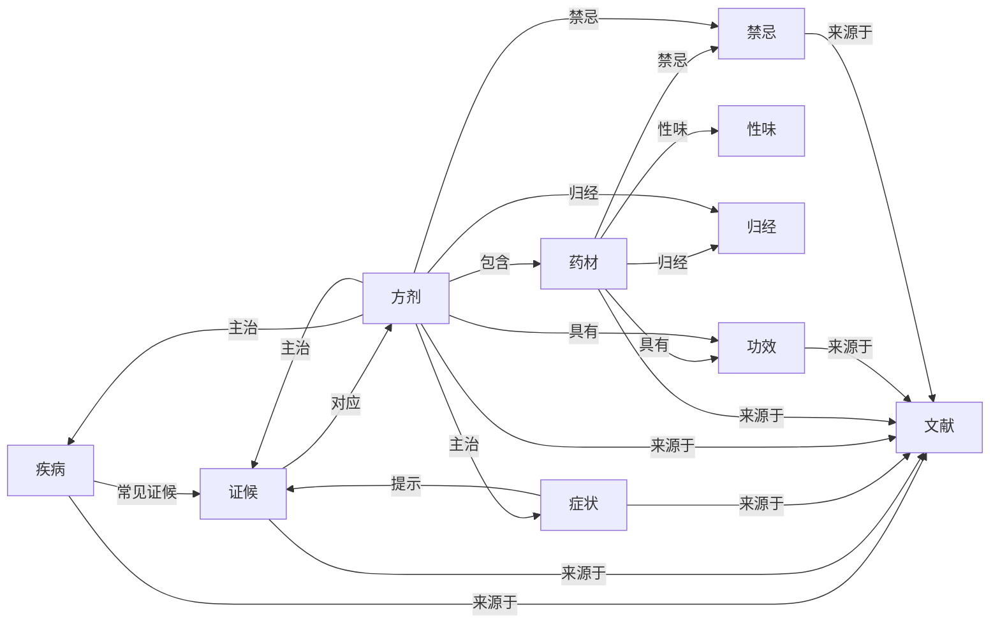
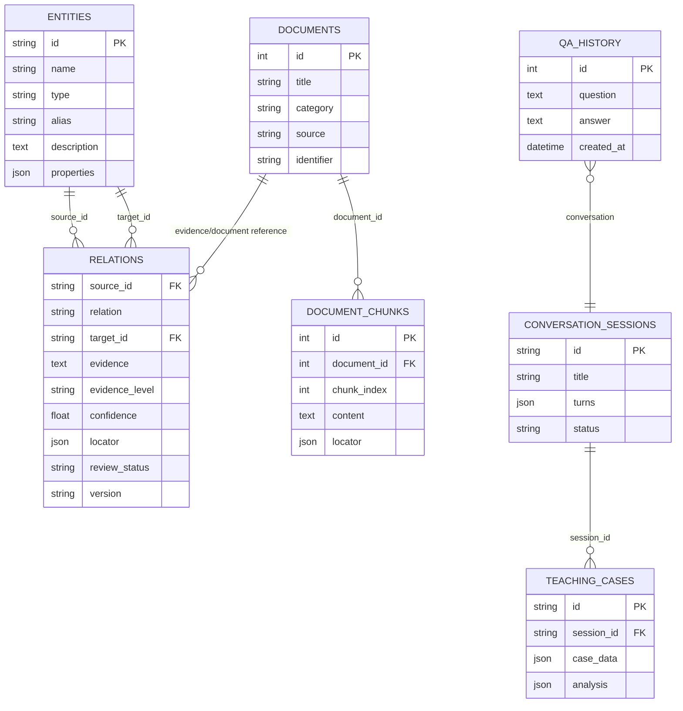
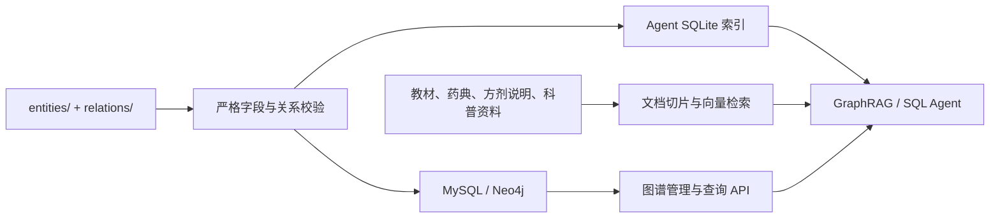

# 中医药知识图谱模式图

## 1. 图谱模式

```mermaid
graph LR
    Disease["疾病"] -->|"常见证候"| Syndrome["证候"]
    Symptom["症状"] -->|"提示"| Syndrome
    Syndrome -->|"对应"| Formula["方剂"]
    Formula -->|"主治"| Disease
    Formula -->|"主治"| Symptom
    Formula -->|"主治"| Syndrome
    Formula -->|"包含"| Herb["药材"]
    Herb -->|"具有"| Effect["功效"]
    Formula -->|"具有"| Effect
    Herb -->|"性味"| Flavor["性味"]
    Herb -->|"归经"| Meridian["归经"]
    Formula -->|"归经"| Meridian
    Herb -->|"禁忌"| Contraindication["禁忌"]
    Formula -->|"禁忌"| Contraindication

    Disease -->|"来源于"| Literature["文献"]
    Syndrome -->|"来源于"| Literature
    Symptom -->|"来源于"| Literature
    Formula -->|"来源于"| Literature
    Herb -->|"来源于"| Literature
    Effect -->|"来源于"| Literature
    Contraindication -->|"来源于"| Literature
```

## 2. 关系库 ER 模式

```mermaid
erDiagram
    ENTITIES ||--o{ RELATIONS : "source_id"
    ENTITIES ||--o{ RELATIONS : "target_id"
    DOCUMENTS ||--o{ DOCUMENT_CHUNKS : "document_id"
    DOCUMENTS ||--o{ RELATIONS : "evidence/document reference"
    CONVERSATION_SESSIONS ||--o{ TEACHING_CASES : "session_id"
    QA_HISTORY }o--|| CONVERSATION_SESSIONS : "conversation"

    ENTITIES {
        string id PK
        string name
        string type
        string alias
        text description
        json properties
    }
    RELATIONS {
        string source_id FK
        string relation
        string target_id FK
        text evidence
        string evidence_level
        float confidence
        json locator
        string review_status
        string version
    }
    DOCUMENTS {
        int id PK
        string title
        string category
        string source
        string identifier
    }
    DOCUMENT_CHUNKS {
        int id PK
        int document_id FK
        int chunk_index
        text content
        json locator
    }
    CONVERSATION_SESSIONS {
        string id PK
        string title
        json turns
        string status
    }
    TEACHING_CASES {
        string id PK
        string session_id FK
        json case_data
        json analysis
    }
    QA_HISTORY {
        int id PK
        text question
        text answer
        datetime created_at
    }
```

## 3. 数据流

```mermaid
flowchart LR
    Files["entities/ + relations/"] --> Gate["严格字段与关系校验"]
    Gate --> Store["MySQL / Neo4j"]
    Gate --> SQLite["Agent SQLite 索引"]
    Store --> GraphAPI["图谱管理与查询 API"]
    SQLite --> Agent["GraphRAG / SQL Agent"]
    Documents["教材、药典、方剂说明、科普资料"] --> Vector["文档切片与向量检索"]
    Vector --> Agent
    GraphAPI --> Agent
```
